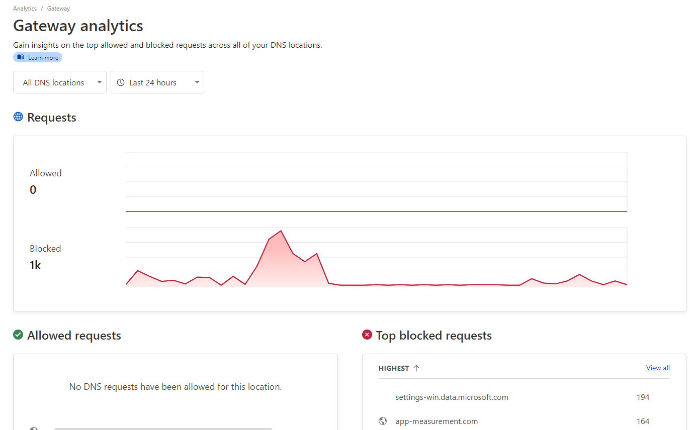

# Cloudflare Gateway Pi-hole Scripts (CGPS)

Cloudflare Gateway allows you to create custom rules to filter HTTP, DNS, and network traffic based on your firewall policies. This is a collection of scripts that can be used to get a similar experience as if you were using Pi-hole, but with Cloudflare Gateway - so no servers to maintain or need to buy a Raspberry Pi!

## About the individual scripts

- `cf_list_delete.js` - Deletes all lists created by CGPS from Cloudflare Gateway. This is useful for subsequent runs.
- `cf_list_create.js` - Takes an input.csv file containing domains and creates lists in Cloudflare Gateway
- `cf_gateway_rule_create.js` - Creates a Cloudflare Gateway rule to block all traffic if it matches the lists created by CGPS.
- `cf_gateway_rule_delete.js` - Deletes the Cloudflare Gateway rule created by CGPS. Useful for subsequent runs.

## Features

- Support for hosts files
- Full support for domain lists
- Automatically cleans up filter lists: removes duplicates, invalid domains, comments and more
- Works fully unattended

## Usage

### Prerequisites

1. Node.js installed on your machine
2. Cloudflare Zero Trust account - the Free plan is enough. Use the Cloudflare documentation for details.
3. Cloudflare email, API key (NOT the API token), and account ID
4. A filter list of domains you want to block - **max 300,000 domains for the free plan** - in the working directory named `input.csv`. Mullvad provides awesome [DNS blocklists](https://github.com/mullvad/dns-blocklists) that work well with this project.

---

1. Clone this repository.
2. Run `npm install` to install dependencies.
3. Copy `.env.example` to `.env` and fill in the values.
4. If this is a subsequent run, execute `cf_gateway_rule_delete.js` and `cf_list_delete.js` (in order) to clean up.
5. If you're on Linux and haven't downloaded any filters yourself, use the `get_recommended_filters.sh` script to download recommended filter lists (about 250 000 domains).
6. Run `cf_list_create.js` to create the lists in Cloudflare Gateway.
7. Run `cf_gateway_rule_create.js` to create the firewall rule in Cloudflare Gateway.
8. Profit!

### Running in GitHub Actions

This project can be run in GitHub Actions so your filter lists will be automatically updated and pushed to Cloudflare Gateway.

[work in progress]
